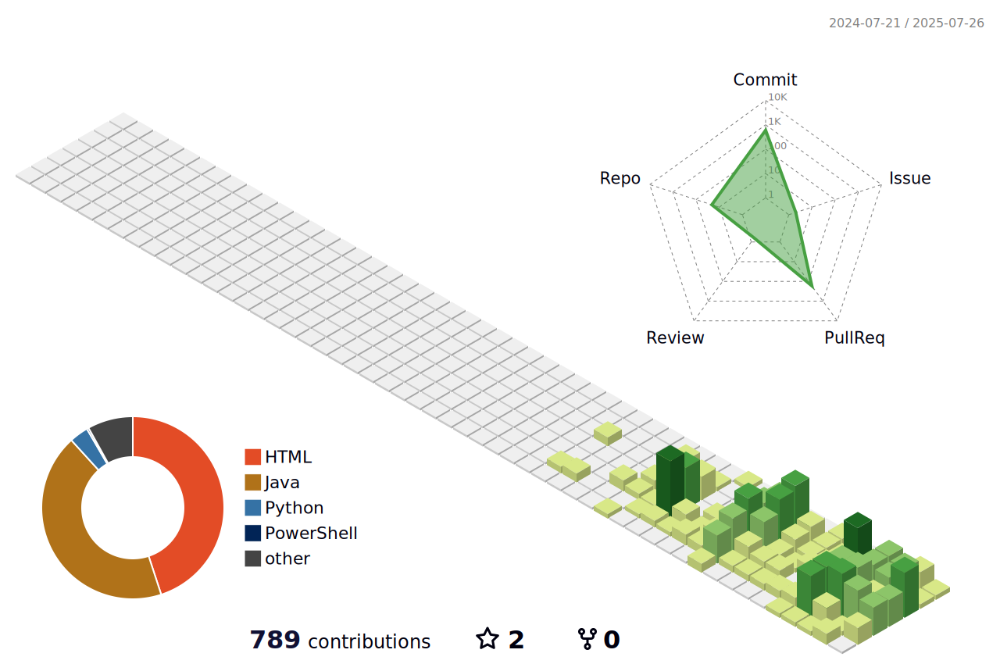

<!-- 인사말 -->

  안녕하세요, 풀스택 개발자 이준영입니다.

<!-- 사용 언어 -->
<h3>🛠️사용 언어</h3>

  
  
  
  
  
   
  
  
  
  
   
  
  
  
  
  

<!-- 프로젝트 테이블 -->
<h3>🧑‍💻진행한 프로젝트</h3>

| 프로젝트명 | 기간 | 기술 스택 | 역할 | 프로젝트 설명 |
|------------|------|-----------|------|-------------------------|
| [Resonos_React](https://github.com/Lee-0210/Resonos_React) | 2025.08.06 ~ 2025.08.22 | Spring Boot, React, MySQL | API 설계, DB 설계, UI 구현 | resonos 프로젝트 리빌드 + 자유커뮤니티 서비스 |
| [Resonos](https://github.com/ruff1376/Resonos) | 2025.06.26 ~ 2025.07.22 | Spring Boot, React, MySQL | API 설계, DB 설계, UI 구현 | 한국 친화적인 음악 리뷰 커뮤니티 서비스 |
| [The Joyful Delivery](https://github.com/skymin022/the_joyful_delivery) | 2025.05.16 ~ 2025.05.28 | HTML, CSS, JavaScript | API 설계, DB 설계, UI 구현 | 좀 더 편리한 택배 접수, 조회 서비스 |

  
   
  
  

 

