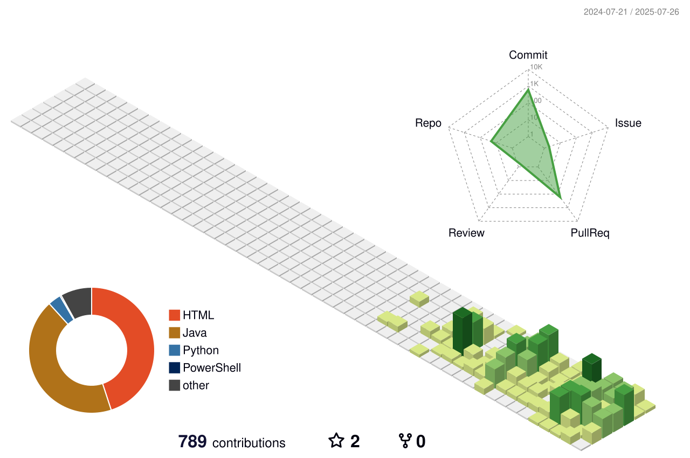

<!-- 인사말 -->

<!-- 내 정보 -->
<h2> 소개</h2>

<!--
|      | 이름 / 소개 | 연락 & 링크 |
|------|------------|------------|
|  | **이준영**  개발 지식을 채우고자 IT 전문 교육을 들으며   전반적인 프로그래밍 언어를 학습하고 있습니다. |       
-->
 
 

<!-- 기술 스택 -->
<h2> 기술 스택</h2>

  
  
  
  
  
  
  
  
   
  
  
  
  
  

 
 

<!-- 프로젝트 테이블 -->
<h2> 진행한 프로젝트</h2>

| 프로젝트명 | 기술 스택 | 역할 | 프로젝트 설명 |
|------------|----------|------|---------------|
|  | Spring Boot, React, MySQL | API 설계, DB 설계, UI 구현 | resonos 프로젝트 리빌드 + 자유커뮤니티 서비스 |
|  | Spring Boot, React, MySQL | API 설계, DB 설계, UI 구현 | 한국 친화적인 음악 리뷰 커뮤니티 서비스 |
|   | JSP/Servlet, MySQL | API 설계, DB 설계, UI 구현 | 편리한 택배 접수, 조회 서비스 |
|  | JSP/Servlet, Oracle | API 설계, DB 설계, UI 구현 | 국내 공연 티켓 예매 + 게시판 채팅 커뮤니티 서비스 |

 
 
 
 
 

<!-- API -->

  
  
  
  

 

