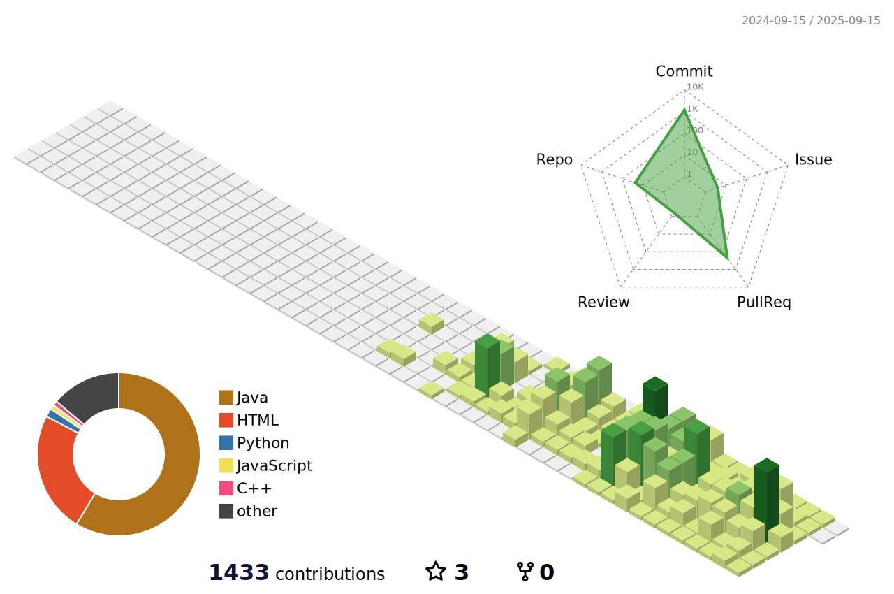

<h1 align="center">안녕하세요 풀스택 개발자 이준영입니다.</h1>

<h3 align="center">Skills</h3>

  
  
  
  
  
   
  
  
  
  
   
  
  
  
  
  

| 프로젝트명          | 기간 | 기술 스택 | 역할 | 프로젝트 설명 |
|-----------          |------|-----------|------|--- |
| Resonos             | 3주 | Spring Boot, React, MySQL | 백엔드 API 설계, DB 설계, UI 제작 | 한국 친화적인 음악 리뷰 커뮤니티 서비스 제공을 목표로 하여 진행하였습니다.
| The Joyful Delivery | 9일 | HTML, CSS, JavaScript | 백엔드 API 설계, DB 설계, UI 제작 | 사용자 친화적인 택배 접수, 조회를 할 수 있는 서비를 목표로 하였습니다.

  
  

 

